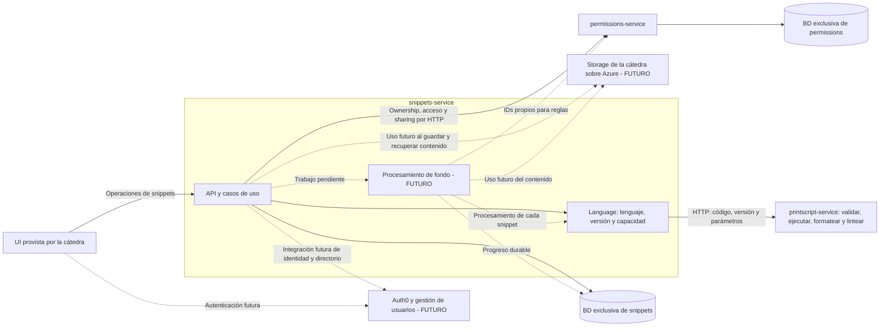

# Arquitectura y flujos de Snippet Searcher

Diagramas editables en Mermaid, basados en la consigna, las US1–16 y las decisiones del equipo. Describen el diseño propuesto; no afirman que estos componentes ya estén integrados en el Compose actual.

## Cómo leerlos

- **Acordado:** snippets coordina los casos de uso; permissions posee ownership y sharing; Language es interno de snippets y delega por HTTP al servicio del lenguaje.
- **Futuro:** Auth0, storage provisto por la cátedra y ejecución de las US9, 10, 12 y 15. Las flechas hacia storage solo señalan momentos de uso, sin definir su interfaz.
- **Propuesta:** reglas por owner + lenguaje + versión, original como última revisión del usuario, formateado como derivado, procesamiento durable dentro de snippets y PrintScript sin BD de negocio propia.

Los perfiles de las User Stories no son roles de autorización. Ningún servicio accede a la base de otro.

## Componentes

PrintScript recibe código y parámetros; no posee snippets ni necesita una BD de negocio para las operaciones actuales. El estado transitorio de una ejecución interactiva no implica persistencia permanente.

## Flujos principales

| Flujo | Fuente | Diagrama |
| --- | --- | --- |
| Crear y actualizar, por archivo o editor | US1–4 | [Creación y actualización](./flows/create-update-snippet.md) |
| Listar, visualizar y descargar | US5–6, US13 | [Consultas y descargas](./flows/read-snippets.md) |
| Compartir y resolver acceso | US7 | [Sharing y permisos](./flows/sharing-permissions.md) |
| Crear tests, ejecutarlos y correrlos tras un update | US8–9, US16 | [Tests](./flows/tests.md) |
| Pedir inputs y mostrar outputs durante la ejecución | US10 | [Ejecución interactiva](./flows/interactive-execution.md) |
| Configurar reglas y generar formateado | US11–12, US13 | [Formatting](./flows/formatting.md) |
| Configurar reglas y evaluar cumplimiento | US14–15, US5–6 | [Linting](./flows/linting.md) |
| Revalidar al cambiar el parser | Consigna general | [Revalidación del parser](./flows/parser-revalidation.md) |

## Recordatorios

- Parser inválido impide guardar; incumplir lint es un resultado; un test fallido nunca revierte el update.
- HTTP alcanza para operaciones puntuales. Los lotes de US12/15 necesitan progreso durable, reanudación y manejo de fallos por snippet; no se elige todavía un broker.
- US9/10 necesitan salida incremental; la sesión interactiva además recibe inputs durante la ejecución.
- Conservar original y formateado. Asociar resultados a revisión de código, reglas y procesador; no publicar resultados obsoletos como actuales.
- Antes de implementar, confirmar el contrato de la UI, alcance de reglas, semántica de original/formateado, límite de una ejecución y contrato futuro de storage.

Para actualizar un diagrama, editar su bloque `mermaid`. Los enlaces entre archivos son relativos; desde Google Docs se utilizan enlaces absolutos de GitHub a estos mismos archivos.
