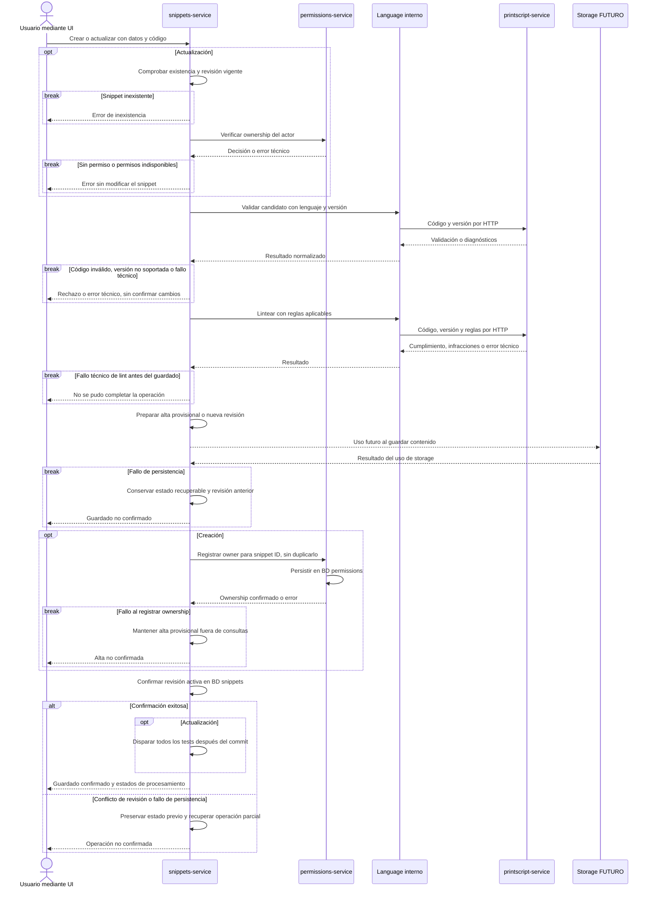

# Creación y actualización de snippets

[Volver al índice](../README.md)

**Fuente:** US1–4. Archivo y editor comparten el mismo caso de uso. La secuencia de alta provisional y el lint inicial síncrono son propuestas; el storage es una dependencia futura.

- La validación del parser debe devolver regla, línea y columna cuando el código es inválido. Las infracciones de lint no impiden guardar un código válido.
- No hay transacción distribuida entre snippets, permissions y storage. La recuperación exacta del contenido queda pendiente del contrato de storage; no se asume atomicidad ni versionado del bucket.
- El update valida el candidato completo, incluso si cambia lenguaje/versión. Los [tests automáticos](./tests.md) no revierten el guardado y los resultados de revisiones anteriores dejan de ser actuales.
