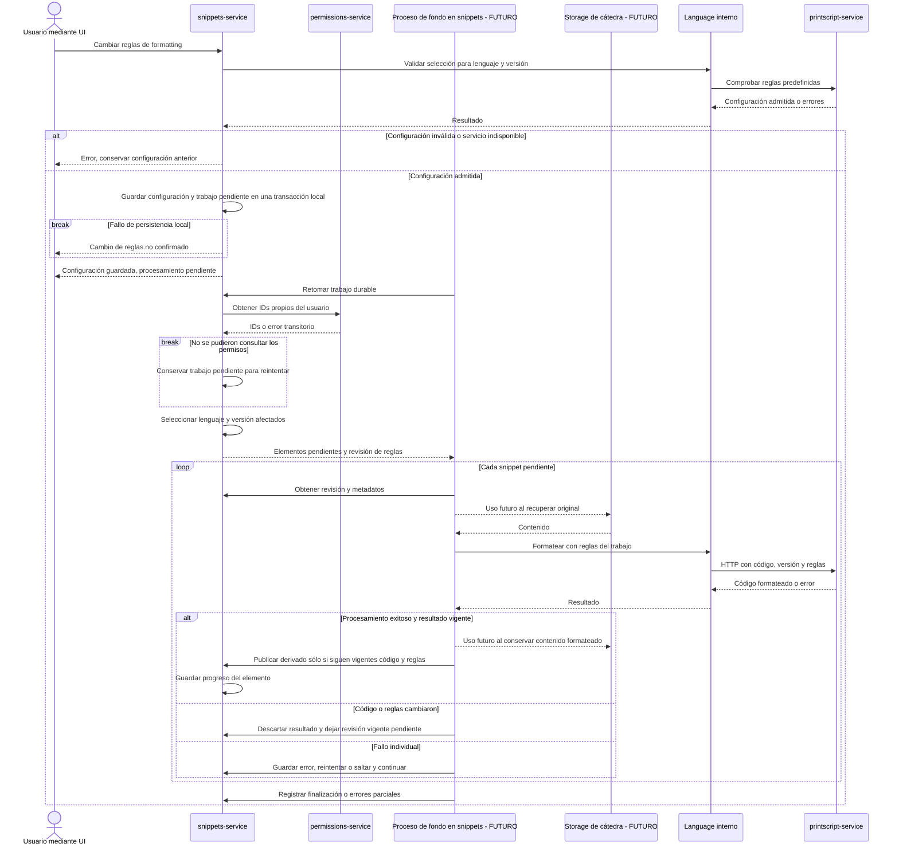

# Formatting y reprocesamiento masivo

[Volver al índice de arquitectura](../README.md)

US11 permite configurar reglas predefinidas; US12 exige reprocesar sin hacer esperar al usuario y con recuperación ante fallos. US13 requiere conservar la descarga original y la formateada. El procesamiento masivo es **futuro**; la secuencia siguiente es una **propuesta de diseño**.

- **Propuesta:** las reglas pertenecen al owner por lenguaje y versión; afectan sus snippets propios. Reprocesar al habilitar o deshabilitar reglas. Este alcance debe confirmarse con la UI.
- **Propuesta:** preservar el original y producir una variante formateada vinculada a la revisión de código y reglas. El storage es una dependencia futura: sus mensajes sólo indican momentos de uso, sin definir su contrato.
- **Requerimiento US12:** conservar avance y recuperarse de fallos. **Propuesta:** trabajo durable dentro de snippets-service, llamadas HTTP por elemento y publicación condicionada a revisiones vigentes. Un fallo de permissions deja el trabajo pendiente; un fallo individual no detiene todo el lote. No se elige todavía broker ni infraestructura.
