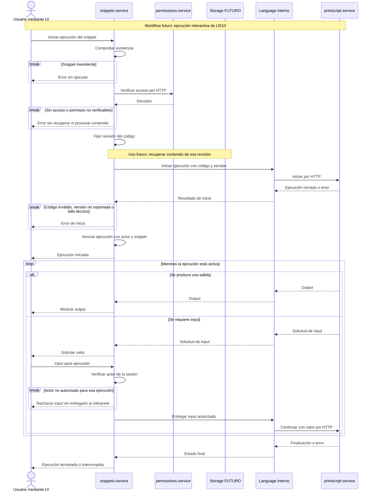

# Ejecución interactiva — US10 futura

PrintScript conserva el estado transitorio del intérprete. `snippets-service` autoriza el inicio, asocia la ejecución al usuario y transmite outputs y solicitudes de input mediante `Language`, su módulo interno.

- **Requerimiento:** US10 necesita outputs e inputs durante la ejecución. La forma concreta del canal incremental debe acordarse con la UI; una respuesta final única no cumple el flujo.
- **Propuestas:** permitir ejecución a quien tiene acceso, fijar la revisión ejecutada y verificar la asociación usuario/ejecución al recibir inputs. No se requiere persistir sesiones como datos de negocio ni reanudarlas tras reiniciar el intérprete.
- **Errores:** distinguir error del programa, caída del servicio y límite de ejecución; informar terminación sin dejar a la UI esperando indefinidamente. Definir límites de tiempo, espera de input y salida antes de implementar.

[Volver a la referencia de arquitectura](../README.md)
