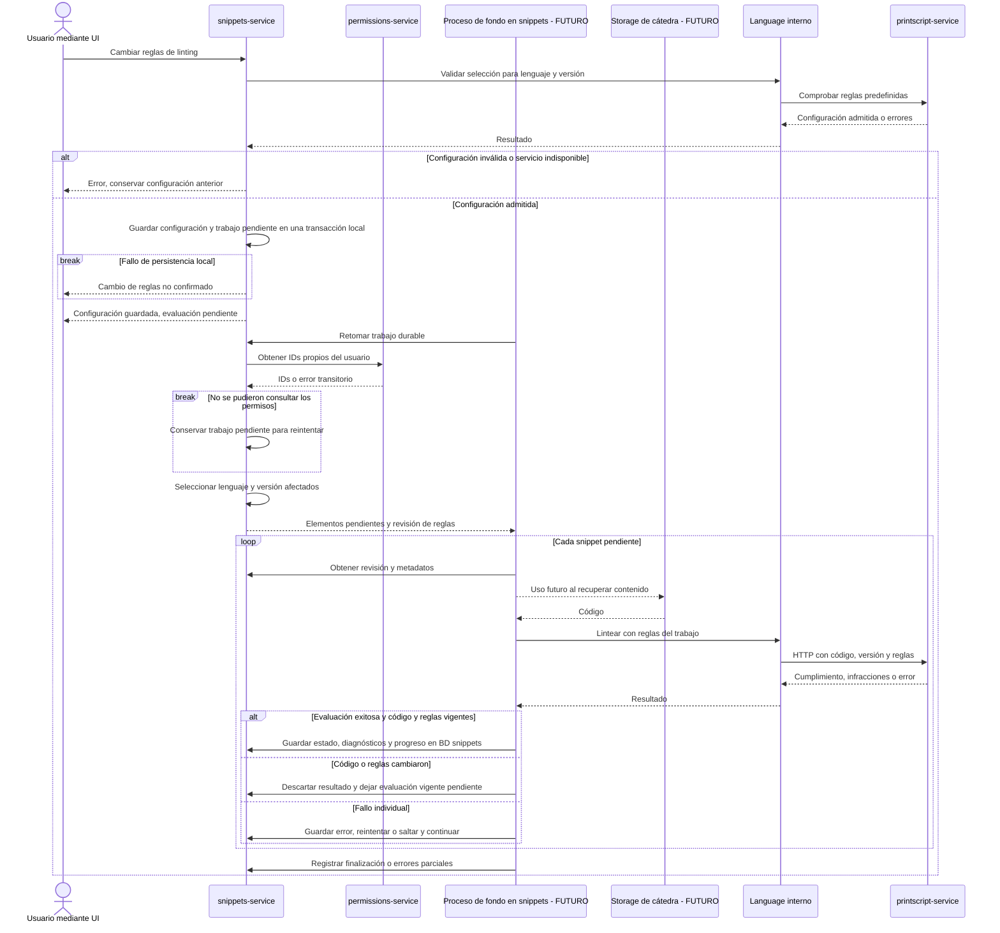

# Linting y reprocesamiento masivo

[Volver al índice de arquitectura](../README.md)

US14 permite configurar reglas predefinidas; US15 exige evaluarlas sobre los snippets sin hacer esperar al usuario y con recuperación ante fallos. Los resultados alimentan listado y detalle. El reprocesamiento masivo es **futuro**; la secuencia siguiente es una **propuesta de diseño**.

- **Propuesta:** configuración por owner, lenguaje y versión; sólo se procesan sus snippets propios. El catálogo y significado de reglas pertenecen a PrintScript; la selección y los resultados persistidos pertenecen a snippets-service.
- **Requerimiento:** linting informa infracciones. **Propuesta:** distinguir cumple, incumple, pendiente y no evaluado por error. Una caída del procesador no significa incumplimiento; linting no modifica el código ni reemplaza la validación del parser.
- **Requerimiento US15:** progreso durable y recuperación de fallos. **Propuesta:** proceso de fondo dentro de snippets-service con HTTP por elemento, sin elegir todavía broker. Ante caída de permissions, mantener el trabajo pendiente. Ante resultados obsoletos, evaluar la revisión vigente. El storage futuro sólo participa al recuperar contenido; su contrato queda pendiente.
