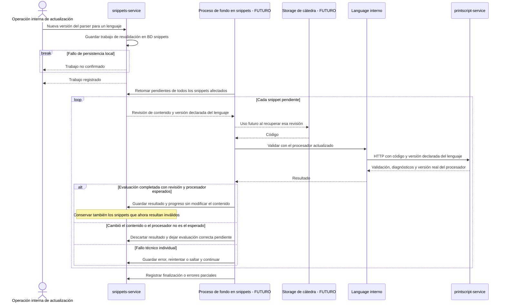

# Revalidación ante una nueva versión del parser

[Volver al índice de arquitectura](../README.md)

La consigna general exige revalidar snippets cuando cambia el parser. La secuencia es una **propuesta de procesamiento futuro**: trabajo durable sobre todos los snippets del lenguaje afectado, sin cambiar su versión declarada de lenguaje.

- **Requerimiento de la consigna:** revalidar ante cambios del parser. **Propuesta:** disparador interno y alcance por lenguaje, para todos los owners. No requiere inventar un rol global de administrador ni consultar permisos de un usuario.
- **Propuesta:** distinguir versión del lenguaje, versión del procesador y revisión del contenido. Conservar los snippets que pasan a ser inválidos y sus diagnósticos; no migrar lenguaje, borrar contenido ni reejecutar automáticamente tests o formatting sin otro requerimiento.
- **Propuesta:** reutilizar el procesamiento durable de lotes, conservar avances y continuar ante errores individuales. Language selecciona la integración; PrintScript procesa por HTTP. El storage futuro sólo aparece al recuperar contenido y no se define su interfaz.
