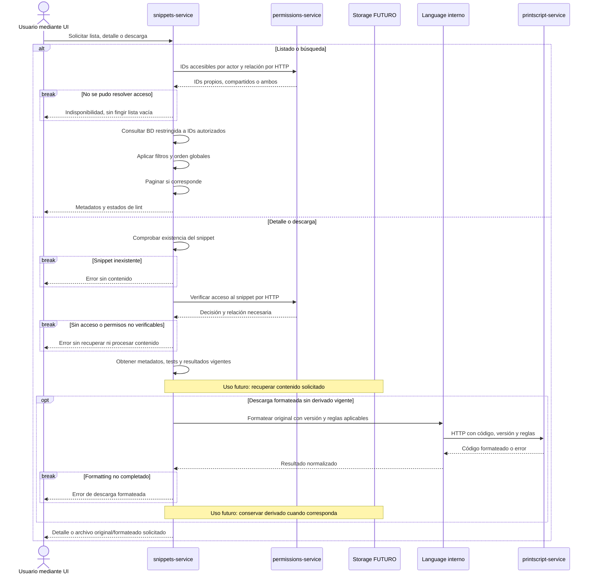

# Búsqueda, visualización y descarga

`permissions-service` determina el universo accesible mediante IDs; `snippets-service` aplica filtros y orden, y entrega contenido y resultados vigentes. La descarga formateada puede requerir procesamiento puntual mediante el módulo interno `Language`.

- **Requerimientos:** US5–6 incluyen propios, compartidos, filtros, orden, tests e infracciones; US13 permite descargar original y formateado. Los diagnósticos deben corresponder al contenido mostrado.
- **Propuestas:** resolver autorización antes de filtros, orden y eventual paginación; no cargar todos los contenidos ni ejecutar lint en cada listado. Obtener IDs accesibles alcanza inicialmente, sujeto al volumen real.
- **Errores y vigencia:** si permissions o storage fallan, informar indisponibilidad. No entregar un derivado viejo como actual; un fallo de formatting no elimina el original. Un resultado de lint pendiente o fallido técnicamente no equivale a incumplimiento.

[Volver a la referencia de arquitectura](../README.md)
