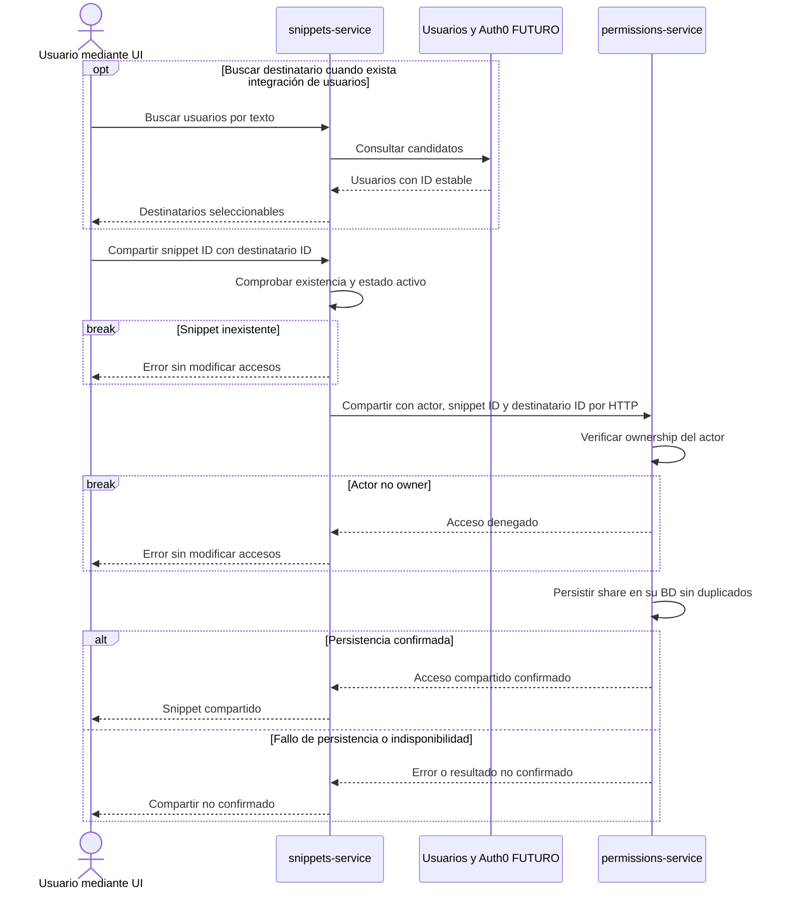

# Sharing y permisos

El owner comparte un snippet existente con otro usuario. `permissions-service` verifica ownership y registra el acceso en una misma operación; el contenido y los tests no se copian.

- **Decisión existente:** `permissions-service` conserva ownership y sharing; no autentica ni es dueño de perfiles. La búsqueda de destinatarios dependerá de la integración futura de usuarios.
- **Requerimiento / propuesta:** compartir permite leer snippet y tests; US9 permite ejecutar tests con acceso. No concede edición ni volver a compartir. Se propone que repetir el mismo share sea idempotente.
- **Errores:** verificar existencia en snippets no reemplaza la comprobación de ownership en permissions. Ante un timeout no se confirma éxito; un reintento idempotente permite resolver el resultado sin duplicar accesos.

[Volver a la referencia de arquitectura](../README.md)
