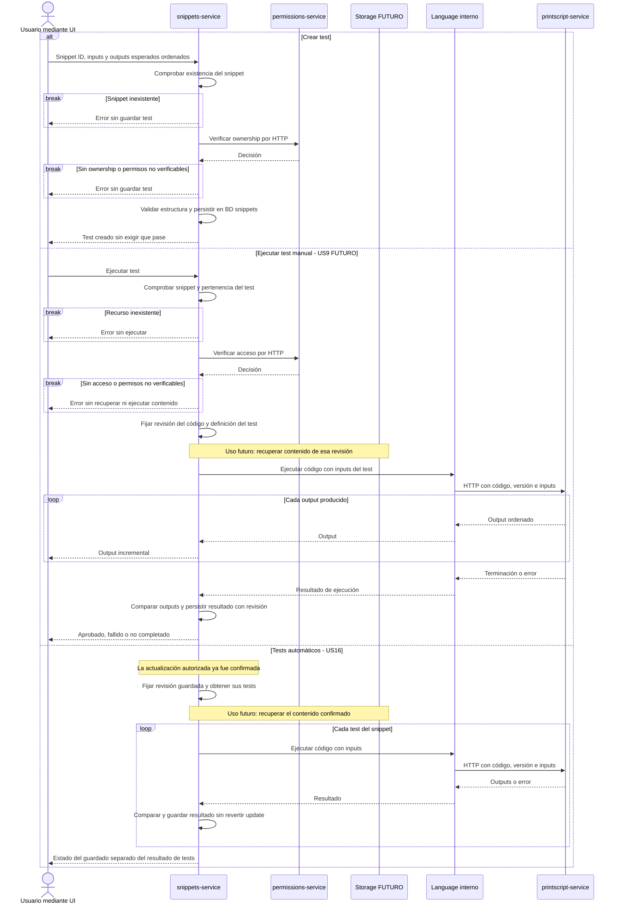

# Tests: creación y ejecución

`snippets-service` conserva las definiciones y compara salidas reales con esperadas. `Language`, módulo interno, delega la ejecución a PrintScript por HTTP; los tests automáticos se ejecutan después de confirmar una actualización.

- **Requerimientos:** crear un test requiere ser owner y admite expectativas que no se cumplan; ejecutar manualmente requiere acceso y entrega output incremental en la futura US9. US16 ejecuta todos los tests tras actualizar, sin revertir el guardado.
- **Propuestas:** fijar revisión de código y definición del test; comparar secuencias respetando orden y cantidad. La normalización de outputs y el alcance de “un test a la vez” deben acordarse con la UI.
- **Errores y persistencia:** una diferencia de outputs es test fallido; una caída o timeout deja la ejecución no completada. Los resultados viven en BD snippets y nunca se muestran como actuales si corresponden a otra revisión. La ejecución postcommit puede ser síncrona si es acotada; pasarla a segundo plano exige registrar trabajo pendiente durable.

[Volver a la referencia de arquitectura](../README.md)
